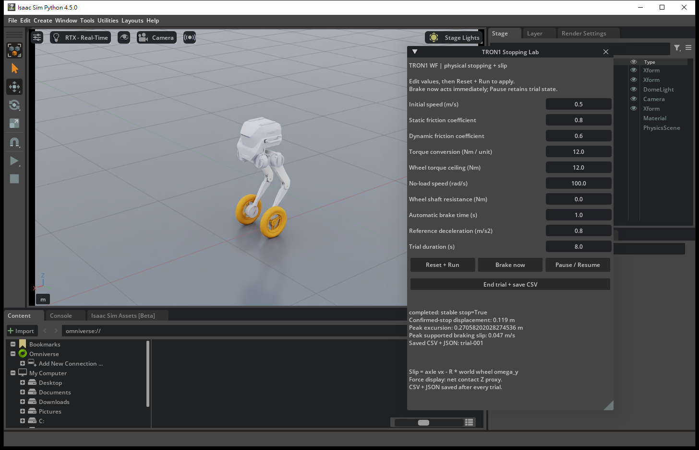

# TRON1 Stopping and Sliding Lab

An interactive Isaac Sim experiment for TRON1 WF braking. Change the initial speed, contact friction, or actuator settings, run the same stopping maneuver, and compare travel, wheel slip, and body balance.



## Run

The local launcher uses the existing Windows Isaac Sim 4.5 installation at `D:\tron1-isaac\isaac-sim-4.5.0`. Double-click **`launch_stopping.cmd`**. It copies this project to `D:\tron1-stopping\project` and writes trials under `D:\tron1-stopping\runs`. This is separate from the human-motion project.

For a fresh checkout, first download the pinned official robot assets:

```bash
python scripts/prepare_assets.py
```

With another Isaac installation, run its bundled Python:

```bash
./python.sh /path/to/tron1-sliding-analysis-for-stopping/scripts/stopping_lab.py
```

On Windows, customize installation/output locations with:

```powershell
.\scripts\run_windows.ps1 -Runtime 'D:\tron1-isaac\isaac-sim-4.5.0' -WorkDir 'D:\tron1-stopping\project'
```

## Interactive experiment

In the **TRON1 Stopping Lab** window, edit settings and select **Reset + Run**. Settings are applied together at reset, including rebuilding the physics state after material edits. Initial base speed and wheel speed are initialized consistently as `omega = v0 / R`.

| Parameter | Meaning / default |
|---|---|
| Initial speed | Signed forward speed, 0.5 m/s |
| Static / dynamic friction | Dimensionless contact coefficients, 0.8 / 0.6; applied to both ground and robot with average combination |
| Torque conversion | Wheel command gain, 12 N·m per unit normalized action |
| Wheel torque ceiling | Per-wheel limit, 12 N·m |
| No-load speed | DC motor torque–speed envelope, 100 rad/s |
| Shaft resistance | Smooth opposing wheel torque, 0 N·m; distinct from ground friction |
| Automatic brake time | Start reducing the velocity reference at 1 s |
| Reference deceleration | Requested speed-ramp slope, 0.8 m/s²; actual deceleration is measured |
| Trial duration | 8 s |

**Brake now** starts braking immediately. **Pause / Resume** suspends the trial without advancing simulation time. **End trial + save CSV** ends a partial trial. Completed trials save automatically; **Reset + Run** starts a new numbered trial. Use these controls for experiment operation.

The panel displays time, axle speed, body pitch, wheel slip, applied wheel torques, and wheel normal-force proxies. Values that fail validation are shown in the panel. Increase static friction before setting dynamic friction above its previous value.

## Model and measurements

The robot has a free base and six leg joints held by implicit PhysX PD drives (500 / 30). A COM-state LQR commands the two wheels to follow a rolling-then-braking reference. The initial baseline uses a rigid-body approximation for controller synthesis; Isaac/PhysX resolves the full articulated dynamics and contact, including slip. Ground contact uses a native infinite PhysX plane at z=0. Physics advances at exactly 200 Hz; GUI rendering is updated separately. No motion policy or human trajectory is required.

Wheel torque is computed as:

```text
u = clip(LQR total wheel torque / 24, -1, 1)     # same command on both wheels
requested wheel torque = torque_conversion * u
applied wheel torque = DC envelope(requested torque, wheel speed) - shaft resistance
```

The net result is bounded by the configured torque ceiling. Conversion is a command-to-shaft torque gain; it does not simulate a gearbox's reflected inertia, efficiency, or backlash. These actuator parameters are experimental settings.

For an approximately upright wheel on horizontal ground:

```text
wheel surface speed = R * world wheel angular velocity about Y
slip speed = axle forward speed - wheel surface speed
slip ratio = -slip speed / max(abs(axle speed), abs(surface speed), 0.05 m/s)
```

World wheel angular velocity includes chassis motion. Slip values in the air are only kinematic differences; use the logged support forces when interpreting them. Wheel normal forces are net link-contact Z proxies. The first version uses PhysX rigid contact with static/dynamic friction; tire compliance and a calibrated tire slip curve are future modeling work.

A stable stop requires at least 0.5 s with axle and wheel surface speeds below 0.05 m/s, pitch/roll below 10°, and both wheel normal-force proxies above 1 N. The trial must also finish and satisfy the same stability dwell at its end. Excessive lean terminates the trial and records failure.

## Analyze a run

Each `trial-NNN` contains `settings.json`, `telemetry.csv`, and `report.json`. Reports include displacement at the first confirmed stop, final displacement, maximum excursion after braking, stop time, slip, and runtime wheel-material readback. This balancing controller briefly accelerates to establish backward lean, then decelerates; it can overshoot and roll back. Use **maximum excursion** to judge required space, rather than the smaller displacement when the stop criterion is first met. Raw telemetry preserves unsuccessful trials.

```bash
python scripts/plot_trial.py /path/to/trial-001
```

This generates `overview.png` with speed, position, slip, body attitude, torque, and support plots. Use a Python environment containing NumPy and Matplotlib. The core tests require NumPy and pytest:

```bash
python -m pytest -q
```

## Initial validation

The local RTX 3060 Ti / Isaac Sim 4.5 run completed the following tests. Each setting has one run; the repeated nominal run produced identical telemetry.

| Setting | Stable stop | Displacement at confirmed stop | Maximum excursion after brake |
|---|---|---:|---:|
| 0.5 m/s, friction 0.8 / 0.6 | Yes | 0.119 m | 0.271 m |
| 1.0 m/s, same friction | Yes | 0.557 m | 0.731 m |
| 0.5 m/s, torque conversion 6 N·m/unit | Yes | 0.131 m | 0.277 m |
| 0.5 m/s, friction 0.04 / 0.02 | No; slipped and fell | — | 0.600 m before termination |

[Nominal analysis plot](results/2026-10-03-validation/nominal/overview.png) · [Low-friction plot](results/2026-10-03-validation/low_friction/overview.png) · [Full validation results](results/2026-10-03-validation/summary.json)

Reproduce the parameter checks in one headless Isaac session:

```powershell
.\scripts\run_windows.ps1 -Headless -AutoRun -ExitAfterTrial -Suite 'D:\tron1-stopping\project\config\validation_suite.json'
```

The suite also checks stationary balance and restores nominal parameters after the altered cases. Runtime friction readback must match each requested setting. A separate [GUI callback check](results/2026-10-03-validation/gui/report.json) verified that pause preserves the robot pose and the manual-brake callback starts braking at 0.5 s. The core has 14 passing tests. These are initial controller and parameter-effect checks; low-friction failure remains an explicit result.

## Sources

The pinned robot asset comes from [LimX TRON1](https://github.com/limxdynamics/tron1-rl-isaaclab/tree/307145edfe95f49c45fd9ccd090ab950e8884b33); its [license](notices/LimX-TRON1-LICENSE.txt) is retained. Asset download, scene setup, LQR mathematics, and extracted inertial parameters originate from our [previous project](https://github.com/Shukashuki/tron1-learning-from-human/tree/f2f2bfe4c88cca936de29ca51000aaf136f21591). Raw robot assets and machine-specific runs are excluded from Git.

Runtime API references: [Isaac Sim 4.5 Core API](https://docs.isaacsim.omniverse.nvidia.com/4.5.0/python_scripting/core_api_overview.html) and [Omniverse interactive UI widgets](https://docs-prod.omniverse.nvidia.com/dev-guide/latest/programmer_ref/ui/widgets/UI_Interactive_Widgets.html).
